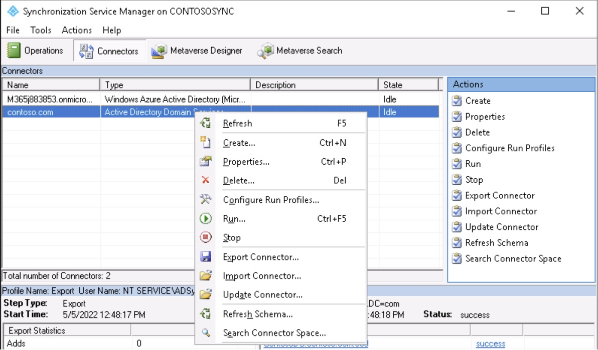

# Changing the AD Connector service account in AD Connect 

## Scenario description
Every now and then I come across an environment where an overprivileged service account is used for the AD connector in AD Connect. More than once I have seen the built-in administrator account being used on the connector. This is not a recommended practice.

During the installation of AD Connect Sync you have the option of letting the installation wizard create an account for you. This will ensure the account will have the appropriate permissions for all the selected features on all OUs that are within the sync scope. This is the recommended way of deploying the AD Connector.

If you are aiming to switch to a different account you could re-run the configuration wizard, have AD Connect create an account for you and be done with it. This is straightforward if you have only a few OUs in your sync scope. If you have a more complex OU-structure (you may need to re-think your AD architecture) the manual selection is error-prone and missing to select an OU can have serious consequences like accounts being deprovisioned from Azure AD (including their resources).

Changing the service account manually can be tedious so I've decided to document my efforts from several cases.

## Step 1: List all connected directories and the synced OUs
In my efforts of documenting existing AD Connect installations (yes I am aware of the AD Connect documenter, not using that because of reasons) I created a script to dump the OUs that are being synced from AD to AAD. The script can be found [here](./ADConnectSyncedOU_v2.ps1).

You can run the script on a member server with an account that has the appropriate permissions on the AD Connect server. The script will start a remote powershell session to the AD Connect server.

	# Get the configuration from AD Connect
	.\ADConnectSyncedOU_v2.ps1 -ADSyncServer <servername> -outputfile <filename>
	

This will return the list of all OU's that are selected for sync. But it doesn't take any parent - child relations into consideration. Usually the permissions from the parent are inherited by the underlying OU so there really is no need to set all the permissions on each individual OU. So the next script will go through the OU list and keep only the OU's that don't have a parent which is also in the sync scope.

Download the script [here](./ADConnectSyncedOU_v2_UniqueParents.ps1). Run it with the parameters inputfile and outputfile. You can guess what each of those parameters do.

	.\ADConnectSyncedOU_v2_UniqueParents.ps1 -inputfile <inputfile.json> -outputfile <outputfile.json>

	# Load the config into a variable.
	$SyncedOU = Get-Content <filename> | ConvertFrom-Json

The synced OU list is what we will use for granting the correct privileges to the new connector account.

## Step 2: Ensuring permissions will apply to all child objects
One of the reasons I hear for using a domain admin account or the built-in administrator account are sync errors when an account with lesser privileges is being used. A possible reason for this is that the permission inheritance is 'broken' on some objects. This could be caused by an account being member of a privileged group (more about that [here](https://docs.microsoft.com/en-us/windows/win32/adschema/a-admincount) and [here](https://docs.microsoft.com/en-us/windows-server/identity/ad-ds/plan/security-best-practices/appendix-c--protected-accounts-and-groups-in-active-directory). The broken inheritance on an object could be a valid setting but it could also be that the account was de-privileged and should just have inheritance enabled. My colleague Chad Cox wrote an article and a remediation script which you can find [here](https://www.linkedin.com/pulse/powershell-find-fix-adminsdholder-orphans-admincount-active-chad-cox/).

The documentation on how to set permissions for an AD Connector account is very proper so we can just follow that to set the permissions needed. The documentation can be found [here](https://docs.microsoft.com/en-us/azure/active-directory/hybrid/how-to-connect-configure-ad-ds-connector-account).

The Powershell module included with the AD Connect installation contains a cmdlet to check for objects that have inheritance disabled. We can use this to loop through the OUs that were gathered in the previous step:

	Foreach ($ou in $syncedOU.SyncedOU)
	{ 
	  Get-ADSyncObjectsWithInheritanceDisabled -SearchBase $ou -ObjectClass *
	}

**NOTE**: You will need some additional logic to target a specific domain if there are multiple connectors. Not documented on the docs page but in the man pages of the cmdlet are the switches targetforest and targetforestcredential which you can use to connect to a different domain.
	

The investigation and potentially required remediation is a bit out of scope for this write-up. It comes down to investigating if the disabled inheritance is valid or not. If it is not valid it could be caused by objects being orphaned former admins, in that case you can use the script from Chad Cox to remediate.

## Step 3: set the correct permissions on the OU within sync scope
Depending on the enabled settings in AD Connect (PHS, writeback and so on) you need to set the appropriate permissions. This is very well documented in the forementioned docs article so I am not going to cover that here. You can loop through the OUs on the same way we looped through them to check disabled inheritance. 

## Step 4: Change the account on the connector
When the account is properly setup we can change the connector. Open the AD Connect 'Synchronization Service Manager' manager to do so.

Go to the properties of the connector space and set the new account.

Kick off a sync to check if all is still working as expected. 

If there are multiple connectors I would recommend to do one at a time.

# Step 5: Deprivilege or deprecate the old account
This step is often forgotten. If the administrator account was used you shouldn't depriv or deprecate. However it would be a good practice to turn it into a 'breakglass' account (reset password to something complex and store it in a sealed envelope in a vault or something).

If any other account was used this is still an account with high privileges that should not linger. So go through a proper clean-up process. Also out of scope for this write-up.

